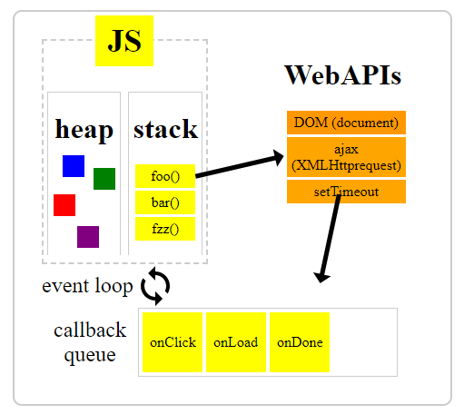

# event loop

JavaScript has a concurrency model based on an event loop

## Stack

Function calls form a stack of frames

## Heap

Objects are allocated in a heap

## Queue

A JavaScript runtime uses a message queue, which is a list of messages to be processed.
