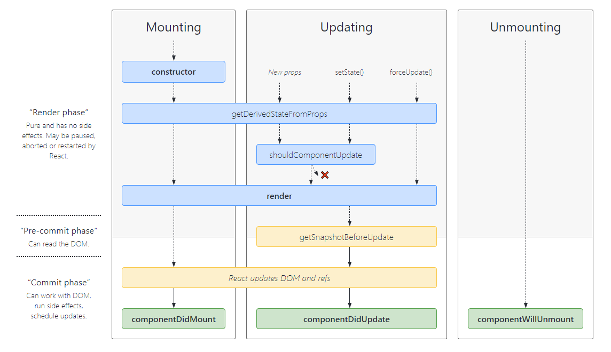

# life cycle



## render

return following types

* React elements // typically craeted via `JSX`
* Arrays and fragments // return multiple elements
* Portals // render children into a different DOM subtree
* String and numbers // text node
* Booleans or null // render nothing

## constructor

Initialize state and bind methods

```js
constructor(props) // assign state to this.state diretcly
```

## componentDidMount

invoke immediately after a component is mounted (inserted into the tree)

## componentDidUpdate

invoke immediately after updating occurs

```js
componentDidUpdate(prevProps, prevState, snapshot)
```

## componentWillUnmount()

invoke immediately before a component is unmounted and destroyed.

## shouldComponentUpdate

performance optimization

## getDerivedStateFromProps

invoke right before calling the render method.

```js
// return an object to update the state, or null to update nothing
static getDerivedStateFromProps(props, state)
```

## getSnapshotBeforeUpdate

invoke right before the most recently rendered
returns value will be passed as a parameter to `componentDidUpdate`

```js
getSnapshotBeforeUpdate(prevProps, prevState)
```

## static getDerivedStateFromError()

## componentDidCatch()
